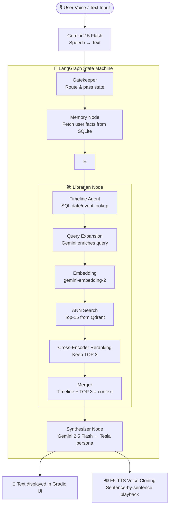

# ⚡ Nikola Tesla Digital Twin

> *"The present is theirs; the future, for which I really worked, is mine."* — Nikola Tesla

A voice-interactive AI digital twin of **Nikola Tesla**, powered by Google Gemini, LangGraph, Qdrant vector search, and F5-TTS voice cloning. Ask Tesla anything — he will answer in his own voice, drawing from his autobiography, Wikipedia biography, and technical writings.

---

## 🎯 Features

- 🎙️ **Voice I/O** — Speak to Tesla via microphone; he replies in a cloned Tesla-like voice (F5-TTS)
- 💬 **Text Mode** — Type questions directly if you prefer
- 🧠 **RAG Pipeline** — 9-step retrieval chain: query expansion → ANN search → cross-encoder reranking → grounded answer
- 🗓️ **Timeline Agent** — Dedicated SQL agent that grounds date/event questions in a structured timeline
- 🔁 **Long-term Memory** — Remembers facts about the user across the conversation (SQLite)
- 🔑 **API Key Rotation** — Supports multiple Gemini keys to avoid rate limits
- ✅ **Pre-built databases ship with the repo** — no ingestion step required for new users

---

## 🏗️ Architecture



---

## 📂 Project Structure

```
tesla-twin/
├── src/
│   ├── app.py                  # Gradio UI + main entry point
│   ├── api_manager.py          # Round-robin Gemini key pool
│   ├── convert_audio.py        # MP3 → WAV reference audio helper
│   ├── agents/
│   │   └── graph.py            # LangGraph state machine (full pipeline)
│   ├── audio/
│   │   └── voice_generator.py  # F5-TTS voice cloning engine
│   ├── ingest/                 # Ingestion pipeline (run only for custom PDFs)
│   │   ├── pdf_parser.py
│   │   ├── chapter_detector.py
│   │   ├── chunker.py
│   │   ├── enricher.py         # Ollama/Qwen2.5 metadata enrichment
│   │   ├── vectorizer.py       # Qdrant embedding + indexing
│   │   ├── databases.py
│   │   └── timeline.py
│   ├── memory/
│   │   └── memory_manager.py   # SQLite long-term user memory
│   ├── persona/
│   │   └── tesla_brain.py      # Tesla system prompt + Gemini response
│   └── rag/
│       ├── librarian.py        # Full RAG retrieval chain
│       └── timeline_agent.py   # SQL timeline agent
├── db/
│   ├── tesla.db                # SQLite (user memory + timeline) ✅ pre-built
│   └── qdrant/                 # Qdrant vector store ✅ pre-built
├── data/
│   ├── raw/                    # Source PDFs (Tesla autobiography, Wikipedia, tech PDF)
│   ├── processed/              # Chunked + enriched JSON files
│   ├── raw_audio/              # tesla_reference.wav (voice cloning reference)
│   └── audio_outputs/          # Runtime-generated WAV files (gitignored)
├── setup.py                    # Smart setup validator
├── requirements.txt
└── .env.sample                 # API key template
```

---

## 🚀 Quick Start

### 1. Clone the repo

```bash
git clone https://github.com/Deepanshu-Nain/Nikola-Tesla-Digital-Twin.git
cd Nikola-Tesla-Digital-Twin
```

### 2. Create your `.env` file

```bash
# Mac / Linux
cp .env.sample .env

# Windows
copy .env.sample .env
```

Open `.env` and add your Gemini API key(s):

```env
GEMINI_API_KEY_1=your_real_key_here
GEMINI_API_KEY_2=optional_second_key
GEMINI_API_KEY_3=optional_third_key
```

> Get a **free** Gemini API key at [aistudio.google.com](https://aistudio.google.com/)  
> Multiple keys are optional but recommended to avoid rate limits.

### 3. Install dependencies

**GPU users (recommended — voice synthesis is very slow on CPU):**
```bash
pip install torch torchaudio --index-url https://download.pytorch.org/whl/cu121
pip install -r requirements.txt
```

**CPU users:**
```bash
pip install -r requirements.txt
```

> **Python 3.10+ required.**

### 4. Validate your setup

```bash
python setup.py
```

This checks your `.env`, verifies the pre-built databases, and confirms the voice reference file. Expected output:
```
  [OK]  .env found with at least one Gemini API key.
  [OK]  SQLite database found — tesla.db
  [OK]  Qdrant vector store found — storage.sqlite
  [OK]  Reference voice found — tesla_reference.wav
  ✅ Ready! Start the Digital Twin with:

       python src/app.py
```

### 5. Launch

```bash
python src/app.py
```

Then open **http://127.0.0.1:7860** in your browser.

---

## 🗣️ Using the App

| Mode | How to use |
|------|-----------|
| **Voice** | Click the microphone, speak your question, stop recording — Tesla replies in audio |
| **Text** | Type in the text box and press Enter — Tesla replies in text + audio |
| **Interrupt** | Click 🛑 **Interrupt** to stop generation / audio playback mid-sentence |

---

## ⚙️ Configuration

### Multiple API Keys

The API manager supports up to 9 Gemini keys, automatically cycling through them to avoid rate limits. Add them to `.env` as `GEMINI_API_KEY_1`, `GEMINI_API_KEY_2`, etc.

### Voice Quality

In `src/audio/voice_generator.py`, the `nfe_step` parameter controls quality vs. speed:

| Setting | Value | Best for |
|---------|-------|----------|
| Fast (default) | `nfe_step=8` | CPU users |
| High quality | `nfe_step=16` | GPU users |

---

## 🔄 Rebuilding the Knowledge Base (Optional)

The pre-built databases ship with the repo — **you do not need this step** unless you want to index your own custom PDFs.

```bash
python setup.py --rebuild
```

> ⚠️ Requires [Ollama](https://ollama.ai/download) with `qwen2.5:3b` pulled:
> ```bash
> ollama pull qwen2.5:3b
> ```
> The rebuild pipeline uses this local model to enrich chunk metadata (keywords, summaries). It can take 10–30 minutes depending on your API quota.

---

## 📚 Knowledge Base Sources

Tesla's digital twin is grounded in three resources:

1. **Wikipedia — Nikola Tesla** — Life events, biographical facts, and legacy
2. **My Inventions: The Autobiography of Nikola Tesla** — First-person voice, thinking patterns, and personal history
3. **Tesla Technical Writings PDF** — Deep technical expertise on AC, wireless energy, and electromagnetic theory

---

## 🐢 Known Limitations

- **Voice is slow on CPU** — F5-TTS voice cloning requires significant compute. A CUDA-capable GPU is strongly recommended for a smooth experience.
- **Ollama is only needed for `--rebuild`** — regular users who just run `python src/app.py` do NOT need Ollama installed.
- **Voice reference is Tesla-like, not original** — No original recording of Nikola Tesla exists. The reference voice is the closest publicly available resemblance, converted from MP3 to WAV.

---

## 🛠️ Tech Stack

| Component | Technology |
|-----------|-----------|
| LLM & Embeddings | Google Gemini 2.5 Flash + gemini-embedding-2 |
| Agent Framework | LangGraph |
| Vector Database | Qdrant (local file-based) |
| Reranking | sentence-transformers cross-encoder |
| PDF Parsing | PyMuPDF (fitz) |
| Voice Synthesis | F5-TTS |
| Metadata Enrichment | Ollama + Qwen2.5 3B (rebuild only) |
| Web UI | Gradio |
| Memory | SQLite |

---

## 👨‍💻 Author

**Deepanshu Nain**  
Roll No: 25/B01/045  
AIMS Project — Digital Twin

---

*"If you only knew the magnificence of the 3, 6 and 9, then you would have a key to the universe."*
