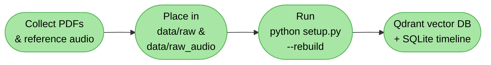

```markdown
Nikola Tesla Digital Twin

> "The present is theirs; the future, for which I have really worked, is mine." — Nikola Tesla

A voice-interactive AI agent that speaks, thinks, and answers as Nikola Tesla — powered by a full RAG pipeline, long-term memory, and real-time voice cloning.


Quick Start (3 Steps)

The knowledge base, PDFs, and reference voice are all pre-built and ship with this repo— you do not need to re-index anything.

Step 1 — Clone & Install

```bash
git clone https://github.com/Deepanshu-Nain/Nikola-Tesla-Digital-Twin.git
cd Nikola-Tesla-Digital-Twin
pip install -r requirements.txt
```

> GPU strongly recommended for real-time voice synthesis (F5‑TTS).  
> GPU users — install PyTorch with CUDA first:
> ```bash
> pip install torch torchaudio --index-url https://download.pytorch.org/whl/cu121
> pip install -r requirements.txt
> ```

### Step 2 — Configure API Keys

```bash
cp .env.sample .env        # Mac/Linux
copy .env.sample .env      # Windows
```

Open `.env` and add your **Google Gemini API key(s)** (free at [aistudio.google.com](https://aistudio.google.com)):

```env
GEMINI_API_KEY_1=your_real_key_here
GEMINI_API_KEY_2=optional_second_key   # rotates automatically to avoid rate limits
GEMINI_API_KEY_3=optional_third_key
```

### Step 3 — Validate & Launch

```bash
python setup.py       # checks env + databases + voice file
python src/app.py     # starts the Gradio UI
```

Open **http://127.0.0.1:7860** and start talking to Tesla. 

---

##  Full Architecture & Pipeline

### Ingestion Pipeline (one‑time, already done — ships with repo)



### Complete System Architecture

```mermaid
flowchart TD
    %% ── Ingestion (top row, green) ──────────────────────────────
    I1([ Collect PDFs\n& reference audio]) --> I2([ Place in data/raw\n& data/raw_audio])
    I2 --> I3([ Run ingest\nsetup.py --rebuild])
    I3 --> I4([ Qdrant vector DB\n+ SQLite timeline])

    %% ── Runtime entry (yellow) ──────────────────────────────────
    I4 --> UI([ User input\nGradio UI])
    UI --> STT([ STT\nGemini 2.5 Flash\nif voice input])
    STT --> LG([ LangGraph\nState Machine])

    %% ── Agent nodes (yellow) ────────────────────────────────────
    LG --> GK([ Gatekeeper\nrouting node])
    LG --> MEM([ Memory\nSQLite user facts])
    GK --> LIB
    MEM --> LIB

    %% ── Librarian + RAG (blue) ──────────────────────────────────
    LIB([ Librarian]) --> TL([ Timeline Agent\nSQL exact-year lookup\noptional])
    LIB --> QE([ Query Expansion\nGemini rewrites query])
    QE --> EMB([ Embedding\ngemini-embedding-2\n3072-dim vector])
    EMB --> ANN([ Qdrant ANN Search\ntop‑15 candidates])
    ANN --> RR([ Cross‑Encoder\nRerank\nms‑marco‑MiniLM])
    RR --> COMB([ Combine retrieved\ncontext + SQL facts])
    TL --> COMB

    %% ── Synthesizer (blue) ──────────────────────────────────────
    COMB --> SYN([ Synthesizer\nGemini 2.5 Flash\nTesla persona prompt])
    MEM --> SYN

    %% ── Output (yellow/bottom) ──────────────────────────────────
    SYN --> FT([ Final text\n50‑80 words as Tesla])
    FT --> SP([ Split into\nsentences])
    SP --> TTS([ F5‑TTS\nVoice Cloning])
    TTS --> OUT([ Stream audio\n+ chat display])

    %% ── Styles ──────────────────────────────────────────────────
    style I1  fill:#a8e6a3,stroke:#4caf50,color:#000
    style I2  fill:#a8e6a3,stroke:#4caf50,color:#000
    style I3  fill:#a8e6a3,stroke:#4caf50,color:#000
    style I4  fill:#a8e6a3,stroke:#4caf50,color:#000

    style UI  fill:#fff3a3,stroke:#f0c000,color:#000
    style STT fill:#fff3a3,stroke:#f0c000,color:#000
    style LG  fill:#fff3a3,stroke:#f0c000,color:#000
    style GK  fill:#fff3a3,stroke:#f0c000,color:#000
    style MEM fill:#fff3a3,stroke:#f0c000,color:#000
    style OUT fill:#fff3a3,stroke:#f0c000,color:#000
    style FT  fill:#fff3a3,stroke:#f0c000,color:#000
    style SP  fill:#fff3a3,stroke:#f0c000,color:#000

    style LIB  fill:#b3e5fc,stroke:#0288d1,color:#000
    style TL   fill:#b3e5fc,stroke:#0288d1,color:#000
    style QE   fill:#b3e5fc,stroke:#0288d1,color:#000
    style EMB  fill:#b3e5fc,stroke:#0288d1,color:#000
    style ANN  fill:#b3e5fc,stroke:#0288d1,color:#000
    style RR   fill:#b3e5fc,stroke:#0288d1,color:#000
    style COMB fill:#b3e5fc,stroke:#0288d1,color:#000
    style SYN  fill:#b3e5fc,stroke:#0288d1,color:#000
    style TTS  fill:#b3e5fc,stroke:#0288d1,color:#000
```



---

##  RAG Pipeline — Step by Step

### Phase 1 — Ingestion (already run — all outputs ship with this repo)

| Step | Script | What it does |
|------|--------|-------------|
| 1 | `databases.py` | Initialise SQLite tables + Qdrant collection |
| 2 | `pdf_parser.py` | Extract raw text page‑by‑page via PyMuPDF |
| 3 | `chapter_detector.py` | Group pages by chapter using regex |
| 4 | `chunker.py` | Sliding‑window chunking — 4 000 chars, 200 overlap |
| 5 | `enricher.py` | **Local** AI metadata extraction — Ollama + Qwen 2.5 3B (keywords, inventions, topics) |
| 6 | `vectorizer.py` | Embed each chunk with `gemini-embedding-2` → upsert to Qdrant |

### Phase 2 — Retrieval (every query)

```
User Query
    │
    ├─► Timeline Agent  ──  regex extracts year → SQL exact lookup
    │                        e.g. "what happened in 1893?" → SQLite hit
    │
    └─► Librarian RAG
            │
            ├─ 1. Query Expansion   Gemini rewrites query for better semantic recall
            ├─ 2. Embed             gemini-embedding-2 → 3072‑dim vector
            ├─ 3. ANN Search        Qdrant cosine similarity, top‑15 candidates
            └─ 4. Cross‑Encoder     ms‑marco‑MiniLM‑L‑6‑v2 rescores pairs → top‑3
```

### Phase 3 — Generation & Voice

```
[Top‑3 chunks] + [SQL facts] + [User memory] + [Last 5 turns]
                            │
                            ▼
                   Gemini 2.5 Flash
               (Tesla persona system prompt)
                            │
                            ▼
                   50‑80 word response
                            │
                     split by sentence
                            │
                            ▼
                  F5‑TTS voice cloning
               (using tesla_reference.wav)
                            │
                            ▼
               Streamed sentence‑by‑sentence
               to Gradio audio + chat panel
```

---

## 🔧 Tech Stack

| Layer | Technology |
|-------|------------|
| LLM | Google Gemini 2.5 Flash |
| Embeddings | `gemini-embedding-2` — 3 072‑dim |
| Agent Framework | LangGraph (state machine) |
| Vector Store | Qdrant — local file‑based |
| Relational DB | SQLite |
| Reranker | `cross-encoder/ms-marco-MiniLM-L-6-v2` |
| Metadata Enrichment | Ollama — Qwen 2.5 3B (fully local) |
| Speech‑to‑Text | Gemini 2.5 Flash (audio upload) |
| Text‑to‑Speech | F5‑TTS — voice cloning |
| UI | Gradio 6.0 |
| PDF Parsing | PyMuPDF (`fitz`) |
| API Key Rotation | Round‑robin pool (`itertools.cycle`) |

---

## 📁 Project Structure

```
tesla-twin/
├── .env.sample              
├── .gitignore
├── requirements.txt
├── setup.py                 # Smart validator + optional --rebuild flag
│
├── data/
│   ├── raw/                 
│   │   ├── my_inventions.pdf
│   │   ├── Nikola_Tesla.pdf
│   │   └── NIKOLA TESLA 145 YEARS OF VISIONARY IDEAS.pdf
│   ├── raw_audio/           
│   │   └── tesla_reference.wav
│   ├── processed/          
│   │   ├── parsed_pages.json
│   │   ├── chapters.json
│   │   ├── chunks.json
│   │   └── enriched_chunks.json
│   ├── audio_outputs/       
│   └── models/              
│
├── db/                      
│   ├── tesla.db             
│   └── qdrant/              
│
└── src/
    ├── app.py              
    ├── api_manager.py       
    ├── convert_audio.py     
    │
    ├── agents/
    │   └── graph.py        
    ├── ingest/              
    │   ├── databases.py
    │   ├── pdf_parser.py
    │   ├── chapter_detector.py
    │   ├── chunker.py
    │   ├── enricher.py
    │   └── vectorizer.py
    ├── rag/
    │   ├── librarian.py    
    │   └── timeline_agent.py
    ├── memory/
    │   └── memory_manager.py
    ├── persona/
    │   └── tesla_brain.py   
    └── audio/
        └── voice_generator.py   
```

---

## 🔄 Rebuilding with Custom Documents (Advanced)

Only needed if you want to add **your own PDFs**:

1. Install [Ollama](https://ollama.ai/download) and pull the model:
   ```bash
   ollama pull qwen2.5:3b
   ```
2. Place your PDFs in `data/raw/`.
3. Run the full rebuild:
   ```bash
   python setup.py --rebuild
   ```

---

## 🔑 API Keys

- Get free Gemini API keys at **https://aistudio.google.com/**
- Add multiple keys to avoid free‑tier rate limits — the `api_manager.py` rotates them automatically via `itertools.cycle`.

---

## 📝 Author

**Deepanshu Nain** — Roll No: 25/B01/045

---
